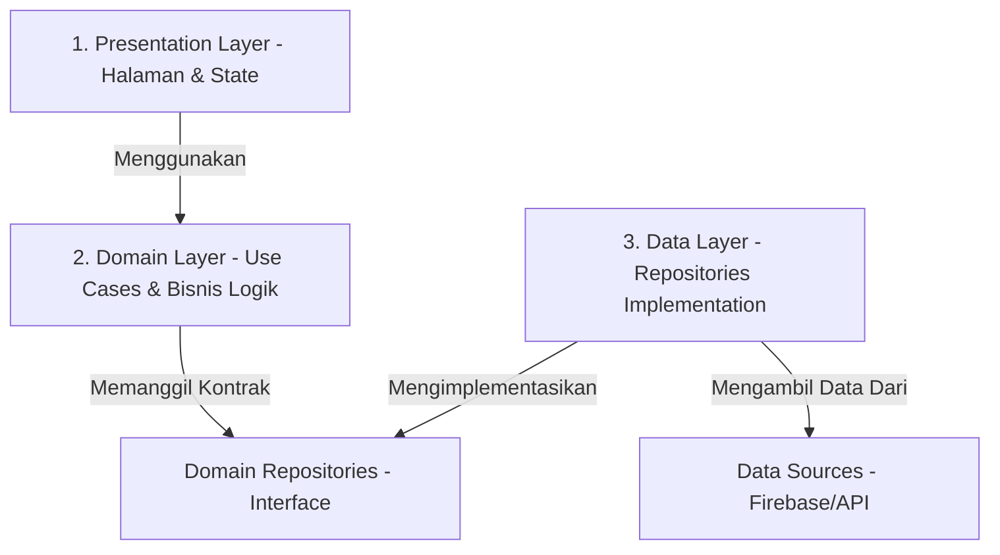

# 📝 Dokumentasi Lengkap Proyek: Lora Health Management
Selamat! Anda telah berhasil membangun **Lora Health Management**, sebuah aplikasi pelacak kesehatan dan kebugaran mobile yang canggih, kaya fitur, dan menggunakan **Clean Architecture** kelas industri. 

Dokumentasi ini dirancang khusus untuk Anda yang sedang mengerjakan proyek mobile besar pertama Anda dengan bantuan AI. Panduan ini menggunakan bahasa Indonesia yang santai namun profesional agar mudah dipahami, membantu Anda menguasai struktur kode Anda sendiri, serta memberikan panduan bagaimana memelihara dan mengembangkannya di masa depan.

---

## 🌟 1. Pendahuluan Proyek
Aplikasi **Lora Health Management** bukan sekadar aplikasi pencatat olahraga biasa. Ini adalah asisten kesehatan personal yang menggabungkan:
1. **Rekomendasi Berbasis Cuaca (Weather-Aware Recommendations):** Mengambil data cuaca real-time untuk menyarankan jenis latihan dan hidrasi yang aman.
2. **Pelacakan Olahraga GPS Real-time:** Menggunakan sensor GPS ponsel untuk melacak rute lari/bersepeda di atas peta OpenStreetMap.
3. **Kalkulator BMI Dinamis:** Dengan visualisasi grafis kustom untuk memantau kemajuan fisik Anda.
4. **Sistem Gamifikasi (EXP & Lencana):** Memotivasi pengguna dengan poin pengalaman, level/rank, dan lencana prestasi (Badges).
5. **Dukungan Multi-bahasa (i18n):** Tersedia dalam Bahasa Indonesia, Inggris, Spanyol, dan Jepang.

Semua ini dibangun di atas fondasi **Flutter (Dart)** dan terhubung secara mulus dengan **Firebase** sebagai backend-nya.

---

## 🏗️ 2. Arsitektur Kode: Clean Architecture
Aplikasi ini dirancang menggunakan **Clean Architecture** (Domain-Driven Design). Ini adalah standar arsitektur modern yang digunakan di industri profesional agar kode rapi, mudah diuji, dan tidak saling ketergantungan secara acak.

Kode dibagi menjadi 3 lapisan utama di setiap fiturnya:



### Penjelasan Lapisan (Analogi Dapur Restoran):
1. **Presentation Layer (Pelayan):**
   * **Tugas:** Menampilkan data ke layar ponsel pengguna dan menerima input (sentuhan, teks).
   * **Komponen:** Halaman (`Pages`), Widget Kustom (`Widgets`), dan `Providers` (State Management).
   * **Analogi:** Seperti pelayan restoran yang mencatat pesanan pelanggan dan mengantarkan makanan yang sudah siap ke meja.
2. **Domain Layer (Koki Utama):**
   * **Tugas:** Inti dari bisnis aplikasi. Di sinilah aturan main didefinisikan (misalnya rumus perhitungan BMI atau aturan prioritas rekomendasi kebugaran). Lapisan ini **tidak boleh** peduli dari database mana data itu berasal atau bagaimana UI merendernya.
   * **Komponen:** `Entities` (struktur data murni) dan `UseCases` (logika aksi tunggal seperti `CalculateBmi` atau `DeleteHistoryItem`).
   * **Analogi:** Seperti koki utama yang tahu resep rahasia dan cara memasak makanan, tanpa perlu tahu sayurnya dibeli dari pasar mana (Data Layer) atau siapa pelayan yang mengantarnya (Presentation Layer).
3. **Data Layer (Supplier Bahan Baku):**
   * **Tugas:** Mengambil data mentah dari dunia luar (Firebase, OpenWeather API, memori lokal HP) lalu mengubahnya menjadi model yang dipahami oleh Domain Layer.
   * **Komponen:** `DataSources` (penghubung langsung ke API/Firebase) dan `RepositoriesImpl` (jembatan implementasi).
   * **Analogi:** Seperti penyuplai bahan makanan yang mengirimkan daging dan sayur segar dari pasar ke dapur restoran.

---

## 📂 3. Struktur Folder Proyek
Berikut adalah peta jalan folder di dalam direktori `/lib/` agar Anda tidak tersesat saat membaca kodenya:

```text
lib/
│
├── auth/                       # Autentikasi Pengguna
│   ├── login_page.dart         # Layar Login (Email, Google, Facebook)
│   ├── services/               # Layar AuthService (Firebase Auth)
│   └── widgets/                # UI pendukung layar login
│
├── core/                       # Fungsionalitas Global (Dipakai semua fitur)
│   ├── constants/              # Warna, API Key, Konstanta aplikasi
│   ├── errors/                 # Pengendalian Error (Either, Failure, Exception)
│   ├── services/               # Tema (Dark/Light), Bahasa (LanguageProvider & Translation)
│   ├── usecases/               # Template dasar UseCase murni
│   └── utils/                  # Alat bantu (seperti ukuran layar responsif)
│
├── features/                   # 🚀 Fitur-Fitur Utama (Sesuai Clean Architecture)
│   ├── bmi/                    # Fitur Kalkulator BMI (Gauge Painter, human painter)
│   ├── dashboard/              # Fitur Beranda Utama & Rekomendasi Cuaca
│   ├── gamification/           # Fitur Gamifikasi (Badges, EXP, Rank)
│   ├── history/                # Fitur Riwayat Olahraga Pengguna
│   ├── map/                    # Fitur Pelacakan GPS, OpenStreetMap, Control Panel
│   ├── notification/           # Fitur Alarm & Local Notifications
│   ├── settings/               # Fitur Pengaturan Profil, Keamanan, Ganti Bahasa
│   ├── statistics/             # Fitur Grafik Statistik Kesehatan & Kalori
│   └── workout/                # Fitur Latihan & Kalkulasi Pembakaran Kalori
│
├── models/                     # Struktur Data Global
├── providers/                  # Provider Tambahan (seperti sensor)
├── screen/                     # Layar Utama Struktur Navigasi
│   ├── navbar.dart             # Navigasi Bawah (Bottom Navigation Bar)
│   ├── onboarding_screen.dart  # Layar Pengenalan saat aplikasi pertama dibuka
│   └── weather_detail.dart     # Detail cuaca lokal
│
├── setup/                      # Setup Awal Pengguna Baru
│   ├── setup_page.dart         # Memilih olahraga kesukaan & profil awal
│   └── views/                  # UI pemilih olahraga
│
├── firebase_options.dart       # Konfigurasi otomatis Firebase dari CLI
└── main.dart                   # Titik masuk utama aplikasi (Entry Point)
```

---

## 🛠️ 4. Integrasi Teknologi Utama & Cara Kerjanya

### A. State Management: Provider
Aplikasi Anda menggunakan **Provider** untuk mengatur alur data. Ini membantu memisahkan visual UI dengan logika perhitungan di balik layar.
* **Cara Kerja:** 
  1. Halaman UI mendaftar ke salah satu `Provider` menggunakan `context.watch<MyProvider>()` atau `Consumer`.
  2. Saat ada perubahan data (misalnya pengguna selesai berolahraga), Provider mengubah status datanya dan memanggil `notifyListeners()`.
  3. Flutter secara otomatis mendeteksi hal tersebut dan menggambar ulang (re-render) bagian layar yang datanya berubah tanpa mengganggu bagian layar yang lain.
* **Provider Utama di `main.dart`:**
  * `LanguageProvider`: Mengurus pergantian bahasa dinamis tanpa restart aplikasi.
  * `ThemeProvider`: Mengatur transisi Dark Mode & Light Mode beserta warna aplikasinya.
  * `DashboardProvider`: Menangani cuaca lokal dan profil beranda.
  * `WorkoutProvider`: Mengatur durasi latihan dan kalkulasi kalori aktif.
  * `HistoryProvider`: Menayangkan riwayat olahraga secara real-time dari Firebase.
  * `BmiProvider`: Menghitung BMI dan menyimpannya ke database.
  * `StatsProvider`: Mengumpulkan data angka untuk dijadikan grafik visual.
  * `SettingsProvider`: Mengurus perubahan data diri pengguna.

### B. Firebase Integration
Aplikasi ini memanfaatkan tiga pilar layanan Firebase:
1. **Firebase Authentication:**
   * Menangani pendaftaran dan login aman. Terintegrasi dengan Google Sign-In dan Facebook Auth untuk mempermudah onboarding pengguna.
2. **Firebase Realtime Database:**
   * **Mengapa dipakai?** Sangat cepat (real-time) untuk data numerik yang sering berubah, seperti poin EXP, tingkat kebugaran, dan status keaktifan sensor.
   * **URL Database:** `https://lora-1-b0d0c-default-rtdb.asia-southeast1.firebasedatabase.app`
3. **Cloud Firestore:**
   * Digunakan untuk pencatatan riwayat terstruktur jangka panjang, data badges yang dibuka, dan notifikasi masuk.

### C. Lokasi, GPS & Peta (GPS Map Tracking)
Untuk fitur pelari atau bersepeda di folder `lib/features/map/`:
* **Geolocator:** Meminta izin GPS ponsel, mendeteksi pergerakan koordinat (Latitude & Longitude) pengguna secara real-time. Dilengkapi dengan algoritma penyaringan noise agar garis rute di peta tidak berantakan ("anti-drift").
* **Flutter Map:** Menggambar peta berbasis ubin (tile) menggunakan OpenStreetMap secara dinamis di layar. Pengguna bisa melihat titik koordinat mereka bergerak langsung di atas peta tanpa membayar biaya Google Maps API.
* **Background Service (`flutter_background`):** Memastikan ponsel tetap melacak GPS meskipun pengguna mematikan layar ponsel atau berpindah ke aplikasi chat lain saat sedang berlari.

### D. Fitur Terjemahan Dinamis (i18n)
Aplikasi mendukung 4 bahasa utama: Indonesia (`id`), Inggris (`en`), Jepang (`ja`/`jp`), dan Spanyol (`es`).
* File JSON terjemahan disimpan di `assets/i18n/`.
* `TranslationService` membaca file JSON yang aktif dan menyediakan method `translate('key.subkey')` untuk menyuplai teks ke UI. Jika bahasa gagal dimuat, aplikasi akan menggunakan Bahasa Indonesia sebagai penyelamat cadangan (*fallback*).

### E. Integrasi API Cuaca & Kualitas Udara (AQI)
Di sinilah kecerdasan asisten kesehatan Anda bekerja secara dinamis berdasarkan lingkungan fisik pengguna:
* **Lokasi Pemanggilan:** Berkas `lib/features/dashboard/data/datasources/weather_remote_datasource.dart` pada fungsi `fetchWeatherAndAQI()`.
* **Cara Kerja:**
  1. Aplikasi mengambil koordinat GPS perangkat terkini menggunakan `Geolocator.getCurrentPosition()`. Jika izin GPS tidak diaktifkan, aplikasi akan menggunakan koordinat default (Kota Malang sebagai *fallback*).
  2. Menggunakan `Future.wait()`, aplikasi secara bersamaan mengirim dua HTTP GET request ke OpenWeatherMap API untuk mengambil **data cuaca** (`ApiConstants.weatherUrl`) dan **kualitas udara/AQI** (`ApiConstants.aqiUrl`).
  3. Respons data ini diolah oleh `DashboardProvider` dan diteruskan ke **PersonalizedRecommendationEngine** untuk merumuskan saran kesehatan yang dipersonalisasi. Misalnya, jika cuaca sangat panas ($\ge 28^\circ\text{C}$), sistem menyarankan latihan ringan di dalam ruangan serta meningkatkan volume hidrasi (air minum). Jika cuaca hujan, sistem menyarankan makanan sup hangat.

### F. Mekanisme "Rolling" Rutinitas & Aktivitas Harian
Agar aplikasi terasa hidup dan selalu berganti secara dinamis, terdapat tiga mekanisme *rolling* otomatis:
1. **Rolling Rotasi Rekomendasi (Interval Detik):**
   * Di dalam `DashboardProvider._startRecommendationRotation()`, terdapat `Timer.periodic` yang berputar setiap **5 detik**.
   * Timer ini memutar indeks daftar saran (`currentRecIndex = (currentRecIndex + 1) % recommendationList.length`) sehingga tips kebugaran di beranda tampak bergulir dinamis secara visual tanpa tindakan dari pengguna.
2. **Rolling Rekomendasi Menu Makanan Harian (Berdasarkan Waktu):**
   * Di `GenerateDailyPlan` (pada berkas `lib/features/dashboard/domain/usecases/generate_recommendations.dart`), menu makanan tidak kaku.
   * Menu disaring berdasarkan kategori BMI pengguna, lalu diacak menggunakan fungsi `.shuffle()` untuk menyajikan rekomendasi makanan yang bervariasi setiap hari agar pengguna tidak bosan.
   * Jam makan juga bergulir secara dinamis mengikuti waktu sistem ponsel pengguna (`DateTime.now().hour`): **SARAPAN** (jam 04:00 - 11:00), **MAKAN SIANG** (jam 11:00 - 16:00), dan **MAKAN MALAM** (selebihnya).
3. **Mekanisme Reset Harian (Daily Roll & Streak):**
   * Pada `BadgeService.checkDailyLogin` dan `BadgeService.processSession`, sistem membandingkan tanggal hari ini (`todayStr` dari `DateTime.now()`) dengan tanggal terakhir di database Firebase (`last_login_date` atau `last_workout_date`).
   * Jika tanggal berbeda, sistem tahu hari baru telah tiba (*rolled over*). Aplikasi akan memberikan bonus EXP harian baru dan menyesuaikan barisan hari latihan (*workout streak*) Anda.

---

## 🔄 5. Alur Data: Contoh Konkret (Data Flow)
Mari kita lihat apa yang terjadi di balik layar saat pengguna melakukan perhitungan dan menyimpan BMI di layar **Kalkulator BMI**:

```text
[Layar BMI Page] ────► [BmiProvider] ────► [UseCase: CalculateBmi] 
      ▲                                            │
      │ (Memicu render ulang UI)                   ▼
[BmiPage Redraw] ◄─── [notifyListeners()] ◄─── [UseCase: SaveBmiHistory]
                                                   │
                                                   ▼
[Firebase RTDB]  ◄─── [BmiRemoteDataSource] ◄─── [BmiRepositoryImpl]
```

1. **Input Pengguna:** Pengguna memasukkan berat badan (misal: 70kg) dan tinggi badan (misal: 175cm) di `bmi_page.dart`, lalu menekan tombol **"Hitung & Simpan"**.
2. **Aksi Provider:** UI memanggil `bmiProvider.calculateAndSave(weight, height)`.
3. **Logika Matematika (Domain):** Provider memanggil Use Case `CalculateBmi` yang melakukan kalkulasi rumus murni:
   $$\text{BMI} = \frac{\text{Berat (kg)}}{\text{Tinggi (m)}^2}$$
   Lalu menentukan status kesehatan: *Underweight*, *Normal*, *Overweight*, atau *Obesity*.
4. **Penyimpanan (Data):** Use Case `SaveBmiHistory` dipanggil. Data dikirim ke `BmiRepositoryImpl`.
5. **Koneksi Firebase:** `BmiRemoteDataSource` mengirimkan objek data hasil kalkulasi beserta stempel waktu (*timestamp*) ke Firebase Realtime Database di jalur: `users/{userID}/bmi_history/`.
6. **Umpan Balik UI:** Begitu Firebase membalas sukses, `BmiProvider` memperbarui status internalnya, memanggil `notifyListeners()`, dan UI di layar langsung menampilkan hasil berupa visualisasi jarum ukur yang bergeser dinamis serta grafik riwayat yang bertambah satu titik baru.

---

## 🏆 6. Bedah Fitur Gamifikasi (EXP & Leveling)
Fitur yang membuat aplikasi Anda terasa sangat interaktif dan premium adalah sistem gamifikasi di `lib/features/gamification/`:

### Sistem Poin EXP (Experience Points)
Setiap kali pengguna selesai berolahraga (lari, bersepeda, basket, dll), sistem di `BadgeService.processSession()` akan memproses poin penghargaan:
* **Base EXP:** Dihitung otomatis berdasarkan durasi latihan dan kalori yang terbakar.
* **Daily Login Bonus:** Memberikan **+20 EXP** jika pengguna membuka aplikasi pertama kali setiap hari.
* **Workout Streak:** Berlatih berturut-turut akan menambah rantai hari (*streak*). Melatih fisik 7 hari berturut-turut memberikan **+200 EXP** bonus mingguan!

### Peringkat Pengguna (Rank System)
Berdasarkan total EXP yang terkumpul, aplikasi membagi kasta pengguna menjadi:

| Peringkat | Syarat Minimal EXP | Maksimal EXP | Ikon / Lencana Level |
| :--- | :---: | :---: | :---: |
| **No Rank** | 0 EXP | 4.999 EXP | `rank_0.png` |
| **Lemah** | 5.000 EXP | 13.999 EXP | `lemah.png` |
| **Lumayan** | 14.000 EXP | 24.999 EXP | `lumayan.png` |
| **Kuat** | 25.000 EXP | 36.999 EXP | `kuat.png` |
| **Sangat Kuat**| 37.000 EXP | 44.999 EXP | `sangatk.png` |
| **Atlit** | 45.000 EXP | 64.999 EXP | `atlit.png` |
| **Dewa** | 65.000 EXP | Ke atas | `dewa.png` |

### Sistem Pembukaan Lencana (Badge Achievements)
Sistem memindai aktivitas pengguna secara otomatis setelah latihan untuk membuka lencana khusus:
* 🏅 **Langkah Pertama (`first_step`):** Menyelesaikan olahraga pertama kali.
* 🔥 **On Fire! (`streak_3`):** Berhasil olahraga 3 hari berturut-turut.
* 🏋️ **Dedikasi (`session_10`):** Menyelesaikan total 10 sesi olahraga.
* 🏃 **Pelari 10K (`dist_10k`):** Mencapai akumulasi jarak lari 10 Kilometer.
* ⚡ **Calorie Burner (`cals_1000`):** Berhasil membakar total 1000 Kalori.
* 🌅 **Early Bird (`time_morning`):** Berolahraga subuh/pagi hari (Jam 04:00 - 08:00).
* 🌃 **Night Owl (`time_night`):** Berolahraga malam hari (Jam 20:00 - 00:00).

---

## 💡 7. Tips Melanjutkan Proyek Menggunakan AI
Membangun proyek mobile pertama Anda menggunakan AI adalah pencapaian yang luar biasa! Untuk menjaga kode ini tetap bersih dan mencegah AI merusak struktur arsitektur yang sudah rapi, gunakan tips berikut:

### 1. Berikan Konteks Clean Architecture saat meminta kode baru
Saat Anda ingin AI menambahkan sebuah fitur baru (misalnya fitur "Catatan Minum Air"), jangan langsung meminta: *"Buatkan halaman minum air di flutter"*.
**Gunakan prompt terstruktur seperti ini:**
> *"Saya memiliki proyek Flutter dengan Clean Architecture. Saya ingin menambahkan fitur 'Catatan Minum Air'. Tolong buatkan kode untuk Domain Layer (Entity dan UseCase), Data Layer (Model, DataSource ke Firebase, dan RepositoryImpl), serta Presentation Layer (Provider dan Halaman UI-nya) secara terpisah sesuai arsitektur proyek saya."*

### 2. Manfaatkan File `core` yang Sudah Ada
Sebelum menyuruh AI membuat pemilih bahasa atau pengatur tema baru, ingatkan dia bahwa Anda sudah memiliki:
* `ThemeProvider` di `lib/core/services/theme_provider.dart`
* `TranslationService` di `lib/core/services/translation_service.dart`
* Desain warna modern di `lib/core/constants/app_colors.dart`

### 3. Cara Menambahkan Fitur Baru dengan Benar:
1. **Langkah 1 (Domain):** Tentukan data apa yang diolah (`Entity`) dan aksi apa saja yang bisa dilakukan (`UseCases`).
2. **Langkah 2 (Data):** Buat penghubung ke Firebase (`DataSource`) lalu sambungkan ke repositori.
3. **Langkah 3 (Presentation):** Buat `Provider` untuk menampung fungsi UseCase, daftarkan di `main.dart` di dalam `MultiProvider`.
4. **Langkah 4 (UI):** Buat halaman baru dan panggil fungsi lewat Provider tersebut.

---

## 🏁 Kesimpulan
Proyek **Lora Health Management** Anda adalah mahakarya awal yang sangat terstruktur. Dengan Clean Architecture ini, proyek Anda sangat layak dipamerkan dalam portofolio lamaran kerja, tugas akhir sidang, maupun dikembangkan lebih lanjut menjadi aplikasi komersil nyata! 

*Tetap konsisten, terus belajar, dan selamat ber-coding bersama AI!* 🚀
